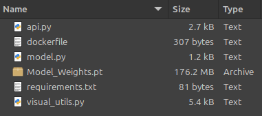
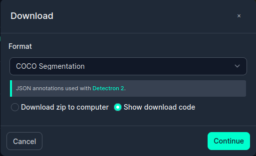

# Hair Detection Neural Network

We finetune the Mask R-CNN neural network to detect hair from an image of a person's face, and create an API to interact with the model.

Mask R-CNN was developed in this paper: https://arxiv.org/abs/1703.06870, and a PyTorch tutorial (which was followed while developing this implementaion) can be found here: https://pytorch.org/tutorials/intermediate/torchvision_tutorial.html

## Setting up the API:

Before the API can be set up, the model weights must be placed in the `app` folder. Either train the model yourself (see the following section), or download a set of weights here: https://drive.google.com/file/d/1dGojYbe9T5IyDSBmo-gjqKjNpg8Ccj16/view?usp=drive_link.

The file structure within `app` must look this this:



Then the API must be run via Docker. Navigate to the `app` folder within a terminal and create a docker image from the dockerfile.

```
docker build . -t <tage_name>
```

Then run the Docker image:

```
docker run -p 8080:8080 -it <tage_name>
```

To access the API, naviagate to the OpenAPI documentation in a webpage:

```
http://localhost:8080/docs
```

## Training the Model

We used the following dataset: https://universe.roboflow.com/slz/hair-seg. Download the COCO Segmentation format as a zip file and place the contents in a folder called `Datasets` in the main repository.



Then we need to set up a virtual enviroment to run the training loop. Run the following in a terminal:

```
conda create -f `env.yaml`
```

Once this is done, run the code in `TestBook.ipynb`, uncommenting the training loop.